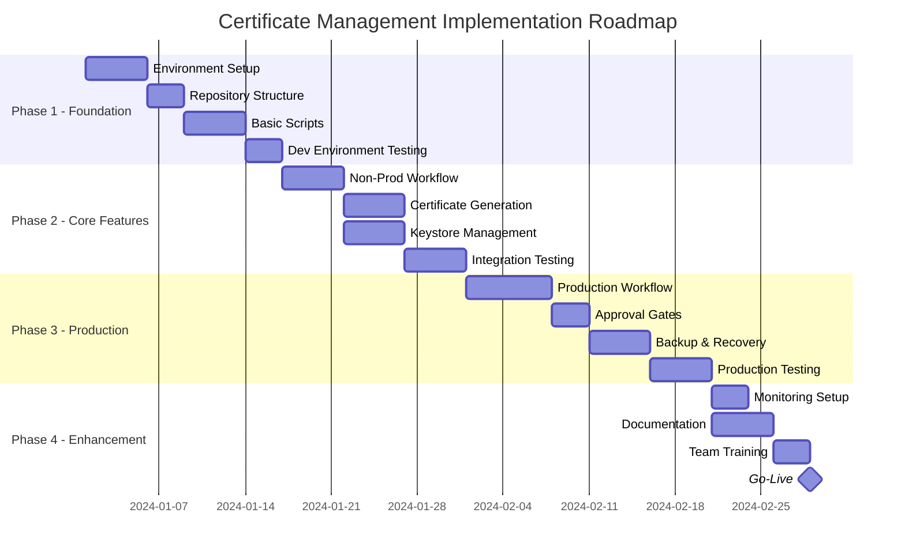
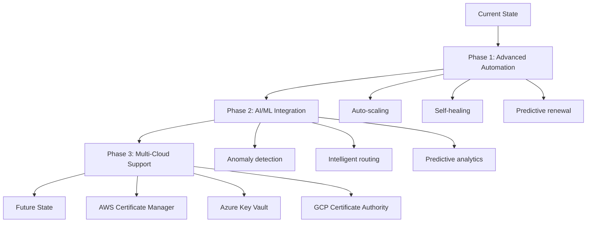

# Apigee Certificate Management Solution
## Design Document - Part 4: Implementation Steps & Best Practices

### Table of Contents
1. [Implementation Roadmap](#implementation-roadmap)
2. [Step-by-Step Implementation Guide](#step-by-step-implementation-guide)
3. [Security Best Practices](#security-best-practices)
4. [Operational Best Practices](#operational-best-practices)
5. [Disaster Recovery & Business Continuity](#disaster-recovery-business-continuity)
6. [Performance Optimization](#performance-optimization)
7. [Compliance & Audit](#compliance-audit)
8. [Future Enhancements](#future-enhancements)

---

## 1. Implementation Roadmap

### 1.1 Implementation Phases



### 1.2 Phase Deliverables

| Phase | Deliverables | Success Criteria |
|-------|--------------|------------------|
| Phase 1 | • GitHub repository setup<br>• Access configuration<br>• Basic authentication | • Successful API connection<br>• Script execution |
| Phase 2 | • Automated workflows<br>• Certificate management<br>• Non-prod deployment | • Daily checks running<br>• Successful renewals |
| Phase 3 | • Production workflow<br>• Approval process<br>• Backup procedures | • Production deployment<br>• Rollback tested |
| Phase 4 | • Monitoring alerts<br>• Documentation<br>• Team enablement | • Zero manual intervention<br>• Team self-sufficient |

## 2. Step-by-Step Implementation Guide

### 2.1 Phase 1: Foundation Setup

#### Step 1: Repository Initialization
```bash
# Create repository structure
mkdir -p .github/workflows scripts config/environments certs docs tests
touch README.md .gitignore

# Initialize git
git init
git add .
git commit -m "Initial repository structure"

# Create .gitignore
cat > .gitignore << EOF
# Certificates
*.pem
*.p12
*.pfx
*.key
*.crt
*.cer

# Backup files
*.backup
*.bak

# Temporary files
*.tmp
.DS_Store

# Sensitive data
*-credentials.json
*-password.txt

# Test outputs
test-results/
coverage/
EOF
```

#### Step 2: Configure GitHub Repository
```yaml
Repository Settings:
  1. General:
     - Default branch: main
     - Disable: Wiki, Issues (use JIRA/ServiceNow)
     - Enable: Actions, Environments
  
  2. Secrets and Variables:
     - Add organization secrets
     - Add environment secrets
     - Configure variable groups
  
  3. Environments:
     - Create: dev, test, uat, production
     - Set protection rules
     - Add required reviewers
  
  4. Branches:
     - Protect main branch
     - Require PR reviews
     - Enable status checks
```

#### Step 3: Initial Configuration Files
```bash
# Create global config
cat > config/apigee-config.json << 'EOF'
{
  "organization": "${APIGEE_ORG}",
  "sso_url": "${APIGEE_SSO_URL}",
  "api_url": "${APIGEE_API_URL}",
  "scheduled_environments": ["dev", "test", "uat"],
  "cert_renewal_days": 30,
  "notification_channels": {
    "slack": {
      "enabled": false,
      "webhook_url_secret": "SLACK_WEBHOOK_URL"
    }
  }
}
EOF

# Create environment configs
for env in dev test uat prod; do
  cat > config/environments/${env}.json << EOF
{
  "keystore_name": "${env}-app-keystore",
  "domain": "app-${env}.example.com",
  "alias_name": "app-${env}-cert",
  "cert_type": "self-signed"
}
EOF
done
```

### 2.2 Phase 2: Core Feature Implementation

#### Step 4: Deploy Core Scripts
```bash
# Copy scripts to repository
cp apigee_auth.sh scripts/
cp apigee_keystore.sh scripts/
cp apigee_certs.sh scripts/

# Make executable
chmod +x scripts/*.sh

# Test scripts locally
export APIGEE_ORG="your-org"
export APIGEE_SSO_URL="https://your-sso.login.apigee.com"
export APIGEE_API_URL="https://api.enterprise.apigee.com/v1"

# Test authentication
./scripts/apigee_auth.sh "your-passcode"
```

#### Step 5: Create Non-Production Workflow
```yaml
# Deploy the non-production workflow
cp apigee-cert-management.yml .github/workflows/

# Test workflow syntax
# Use GitHub's workflow syntax validator or act tool
act -W .github/workflows/apigee-cert-management.yml --dryrun
```

#### Step 6: Configure Secrets
```bash
# Using GitHub CLI
gh secret set APIGEE_ORG --body "your-organization"
gh secret set APIGEE_SSO_URL --body "https://your-sso.login.apigee.com"
gh secret set APIGEE_API_URL --body "https://api.enterprise.apigee.com/v1"

# Set environment-specific secrets
for env in DEV TEST UAT; do
  gh secret set APIGEE_SSO_PASSCODE_${env} --env ${env,,}
  gh secret set KEYSTORE_PASSWORD_${env} --env ${env,,}
done
```

### 2.3 Phase 3: Production Implementation

#### Step 7: Production Workflow Setup
```bash
# Deploy production workflow
cp apigee-cert-prod-deployment.yml .github/workflows/

# Configure production environment
gh api repos/:owner/:repo/environments/production \
  --method PUT \
  --field wait_timer=300 \
  --field prevent_self_review=true \
  --field reviewers[][id]=TEAM_ID \
  --field deployment_branch_policy[protected_branches]=true
```

#### Step 8: Test Production Deployment
```yaml
Test Plan:
  1. Dry Run Test:
     - Execute with dry_run=true
     - Verify all validations pass
     - Check no actual deployment
  
  2. Test Environment:
     - Create test-prod environment
     - Mimic production settings
     - Full deployment test
  
  3. Rollback Test:
     - Deploy known good cert
     - Deploy bad cert
     - Execute rollback
     - Verify restoration
```

### 2.4 Phase 4: Enhancement and Go-Live

#### Step 9: Monitoring Setup
```bash
# Create monitoring dashboard config
cat > monitoring/dashboard.json << 'EOF'
{
  "name": "Apigee Certificate Management",
  "panels": [
    {
      "title": "Certificate Expiry Status",
      "type": "table",
      "query": "certificate_days_remaining by environment"
    },
    {
      "title": "Workflow Execution Status",
      "type": "graph",
      "query": "workflow_status by environment"
    },
    {
      "title": "Error Rate",
      "type": "counter",
      "query": "error_count by type"
    }
  ]
}
EOF
```

#### Step 10: Documentation and Training
```markdown
# Create operational runbook
docs/runbook.md:
  - Daily Operations
  - Emergency Procedures
  - Troubleshooting Guide
  - Contact Information

# Create training materials
docs/training/:
  - setup-guide.md
  - workflow-guide.md
  - troubleshooting.md
  - faq.md
```

## 3. Security Best Practices

### 3.1 Secret Management

```yaml
Secret Management Guidelines:
  Storage:
    - Use GitHub encrypted secrets only
    - Never commit secrets to repository
    - Rotate secrets quarterly
    - Use different secrets per environment
  
  Access:
    - Principle of least privilege
    - Environment-specific access
    - Audit secret access logs
    - Use service accounts where possible
  
  Rotation:
    - Automate password rotation
    - Track secret expiry dates
    - Maintain rotation audit trail
    - Test after rotation
```

### 3.2 Certificate Security

```yaml
Certificate Security Practices:
  Generation:
    - Minimum 2048-bit RSA keys
    - Use strong random number generation
    - Validate certificate chains
    - Enforce certificate policies
  
  Storage:
    - Encrypt certificates at rest
    - Limit certificate access
    - Audit certificate usage
    - Secure backup storage
  
  Transmission:
    - Use TLS for all API calls
    - Validate SSL certificates
    - Implement certificate pinning
    - Monitor for MITM attacks
```

### 3.3 Access Control

```yaml
Access Control Matrix:
  Developers:
    - Read access to non-prod
    - Execute non-prod workflows
    - No production access
  
  DevOps:
    - Full non-prod access
    - Read production logs
    - Execute with approval
  
  Security Team:
    - Full access all environments
    - Approve production changes
    - Audit trail access
  
  Automation:
    - Service account per environment
    - Minimal required permissions
    - No interactive access
```

## 4. Operational Best Practices

### 4.1 Monitoring and Alerting

```yaml
Monitoring Strategy:
  Proactive Monitoring:
    - Certificate expiry countdown
    - Workflow execution status
    - API availability checks
    - Error rate tracking
  
  Alert Thresholds:
    - Critical: < 7 days to expiry
    - Warning: < 30 days to expiry
    - Error: Workflow failures
    - Info: Successful renewals
  
  Alert Channels:
    - Critical: PagerDuty + Slack + Email
    - Warning: Slack + Email
    - Error: Slack + Email
    - Info: Slack only
```

### 4.2 Change Management

```yaml
Change Management Process:
  Non-Production:
    - Automated approval for renewals
    - Manual approval for config changes
    - Peer review for script changes
  
  Production:
    - CAB approval required
    - Change ticket mandatory
    - Rollback plan documented
    - Post-deployment verification
  
  Emergency Changes:
    - Expedited approval process
    - Security team override
    - Post-mortem required
    - Documentation within 24h
```

### 4.3 Capacity Planning

```yaml
Capacity Considerations:
  API Limits:
    - Apigee API rate limits
    - Let's Encrypt rate limits
    - DNS provider limits
  
  Workflow Limits:
    - Concurrent workflow runs
    - GitHub Actions minutes
    - Artifact storage limits
  
  Scaling Strategy:
    - Stagger environment checks
    - Implement request queuing
    - Use caching where appropriate
    - Monitor usage trends
```

## 5. Disaster Recovery & Business Continuity

### 5.1 Backup Strategy

```yaml
Backup Requirements:
  What to Backup:
    - Current certificates
    - Configuration files
    - Workflow definitions
    - Access credentials
  
  Backup Schedule:
    - Before each deployment
    - Daily configuration backup
    - Weekly full backup
    - Monthly archive
  
  Backup Storage:
    - Primary: GitHub artifacts
    - Secondary: S3/Azure Storage
    - Tertiary: Offline archive
    - Encryption: AES-256
```

### 5.2 Recovery Procedures

```yaml
Recovery Scenarios:
  Certificate Corruption:
    1. Identify affected certificate
    2. Retrieve from backup
    3. Validate backup integrity
    4. Deploy via emergency workflow
    5. Verify service restoration
  
  Complete System Failure:
    1. Activate DR environment
    2. Restore from latest backup
    3. Manually deploy certificates
    4. Validate all services
    5. Fail back when ready
  
  Workflow Failure:
    1. Check workflow logs
    2. Identify failure point
    3. Manual intervention if needed
    4. Fix and re-run
    5. Post-mortem analysis
```

### 5.3 Business Continuity Plan

```yaml
BCP Components:
  RTO/RPO Targets:
    - RTO: 4 hours
    - RPO: 24 hours
    - MTTR: 2 hours
  
  Alternate Procedures:
    - Manual certificate deployment
    - Direct Apigee console access
    - Emergency contact list
    - Escalation procedures
  
  Communication Plan:
    - Incident commander designation
    - Stakeholder notification
    - Status page updates
    - Post-incident report
```

## 6. Performance Optimization

### 6.1 Workflow Optimization

```yaml
Optimization Techniques:
  Parallel Processing:
    - Check multiple environments concurrently
    - Batch API operations
    - Async certificate generation
  
  Caching:
    - Cache authentication tokens
    - Store certificate metadata
    - Reuse API responses
  
  Resource Usage:
    - Optimize runner size
    - Minimize artifact size
    - Clean up temporary files
    - Efficient log rotation
```

### 6.2 API Optimization

```yaml
API Best Practices:
  Request Optimization:
    - Batch operations where possible
    - Use field filters
    - Implement pagination
    - Compress payloads
  
  Connection Management:
    - Connection pooling
    - Keep-alive headers
    - Retry with backoff
    - Circuit breaker pattern
  
  Error Handling:
    - Graceful degradation
    - Cached fallbacks
    - Queue failed requests
    - Async retry
```

## 7. Compliance & Audit

### 7.1 Compliance Requirements

```yaml
Compliance Framework:
  Standards:
    - SOC 2 Type II
    - ISO 27001
    - PCI DSS (if applicable)
    - Industry-specific
  
  Controls:
    - Access control logs
    - Change audit trail
    - Certificate lifecycle tracking
    - Automated compliance reports
  
  Evidence Collection:
    - Workflow execution logs
    - Approval records
    - Configuration changes
    - Security scans
```

### 7.2 Audit Trail

```yaml
Audit Requirements:
  What to Audit:
    - All certificate operations
    - Configuration changes
    - Access attempts
    - Workflow executions
  
  Audit Storage:
    - Immutable log storage
    - Minimum 7 year retention
    - Encrypted at rest
    - Tamper detection
  
  Audit Reports:
    - Monthly compliance report
    - Quarterly security review
    - Annual audit summary
    - On-demand investigation
```

### 7.3 Compliance Automation

```yaml
Automated Compliance:
  Continuous Monitoring:
    - Certificate expiry tracking
    - Unauthorized access alerts
    - Configuration drift detection
    - Policy violation alerts
  
  Automated Reports:
    - Daily status reports
    - Weekly summary reports
    - Monthly compliance reports
    - Exception reports
  
  Evidence Generation:
    - Automated log collection
    - Screenshot capture
    - Configuration snapshots
    - Approval documentation
```

## 8. Future Enhancements

### 8.1 Roadmap for Enhancements



### 8.2 Enhancement Priorities

| Priority | Enhancement | Business Value | Effort |
|----------|-------------|---------------|--------|
| High | Multi-region support | Disaster recovery | Medium |
| High | API Gateway integration | Broader adoption | High |
| Medium | Mobile app notifications | Faster response | Low |
| Medium | ChatOps integration | Improved UX | Medium |
| Low | Blockchain audit trail | Immutable records | High |
| Low | Quantum-safe certificates | Future-proofing | High |

### 8.3 Technology Improvements

```yaml
Planned Improvements:
  Infrastructure:
    - Kubernetes operator
    - Terraform modules
    - Helm charts
    - Service mesh integration
  
  Automation:
    - AI-powered predictions
    - Self-healing workflows
    - Intelligent retry logic
    - Dynamic scaling
  
  Security:
    - Hardware security modules
    - Zero-trust architecture
    - Quantum-resistant algorithms
    - Advanced threat detection
  
  Integration:
    - ServiceNow automation
    - JIRA integration
    - Splunk forwarding
    - Datadog metrics
```

## 9. Success Metrics

### 9.1 Key Performance Indicators

```yaml
Operational KPIs:
  Availability:
    - Certificate availability: 99.99%
    - Workflow success rate: 99.9%
    - API uptime: 99.95%
  
  Performance:
    - Certificate renewal time: < 5 minutes
    - Workflow execution time: < 10 minutes
    - Alert response time: < 2 minutes
  
  Efficiency:
    - Manual intervention rate: < 1%
    - Auto-renewal success: > 99%
    - False positive rate: < 5%
```

### 9.2 Business Metrics

```yaml
Business Impact:
  Cost Savings:
    - Reduced manual effort: 40 hours/month
    - Prevented outages: $100k/year
    - Automation ROI: 300%
  
  Risk Reduction:
    - Certificate expiry incidents: 0
    - Security vulnerabilities: 0
    - Compliance violations: 0
  
  Operational Excellence:
    - Team satisfaction: > 4.5/5
    - Process maturity: Level 4
    - Innovation index: High
```

## 10. Implementation Checklist

### 10.1 Pre-Implementation Checklist

- [ ] Apigee organization access confirmed
- [ ] GitHub repository created
- [ ] Team members identified and trained
- [ ] Security review completed
- [ ] Compliance requirements documented
- [ ] Backup strategy defined
- [ ] Monitoring tools configured
- [ ] Change management process approved

### 10.2 Implementation Checklist

- [ ] Phase 1: Foundation
  - [ ] Repository structure created
  - [ ] Scripts deployed and tested
  - [ ] Basic authentication working
  - [ ] Development environment configured

- [ ] Phase 2: Core Features
  - [ ] Non-production workflow deployed
  - [ ] Certificate generation tested
  - [ ] Keystore management working
  - [ ] Daily automation verified

- [ ] Phase 3: Production
  - [ ] Production workflow deployed
  - [ ] Approval gates configured
  - [ ] Backup procedures tested
  - [ ] Rollback verified

- [ ] Phase 4: Enhancement
  - [ ] Monitoring dashboards created
  - [ ] Alerts configured
  - [ ] Documentation complete
  - [ ] Team training delivered

### 10.3 Post-Implementation Checklist

- [ ] All environments tested
- [ ] Runbooks updated
- [ ] Team handover complete
- [ ] Lessons learned documented
- [ ] Success metrics baselined
- [ ] Continuous improvement plan created
- [ ] Stakeholder sign-off obtained
- [ ] Celebration completed! 🎉

## 11. Support and Maintenance

### 11.1 Support Model

```yaml
Support Structure:
  L1 Support:
    - Monitor alerts
    - Execute runbooks
    - Basic troubleshooting
    - Escalate complex issues
  
  L2 Support:
    - Advanced troubleshooting
    - Script modifications
    - Workflow updates
    - Performance tuning
  
  L3 Support:
    - Architecture changes
    - Security updates
    - Major enhancements
    - Vendor escalation
```

### 11.2 Maintenance Schedule

```yaml
Maintenance Activities:
  Daily:
    - Monitor certificate status
    - Check workflow executions
    - Review error logs
  
  Weekly:
    - Verify backup integrity
    - Review performance metrics
    - Update documentation
  
  Monthly:
    - Rotate credentials
    - Security patching
    - Capacity review
    - Team sync meeting
  
  Quarterly:
    - Architecture review
    - Disaster recovery test
    - Compliance audit
    - Enhancement planning
```

## 12. Conclusion

### 12.1 Summary

This comprehensive Apigee Certificate Management Solution provides:

- **Automated certificate lifecycle management** across all environments
- **Enterprise-grade security** with approval workflows and audit trails
- **Zero-downtime deployments** with automated renewal and rollback capabilities
- **Comprehensive monitoring** and alerting for proactive management
- **Scalable architecture** that grows with your organization

### 12.2 Next Steps

1. **Review and approve** the design document with stakeholders
2. **Allocate resources** for implementation team
3. **Begin Phase 1** implementation following the roadmap
4. **Establish governance** and change management processes
5. **Plan for continuous improvement** post-implementation

### 12.3 Key Success Factors

- **Executive sponsorship** and organizational commitment
- **Cross-functional collaboration** between teams
- **Adherence to best practices** and security standards
- **Continuous monitoring** and improvement
- **Comprehensive documentation** and knowledge transfer

---

*This design document provides a complete blueprint for implementing an enterprise-grade certificate management solution for Apigee Edge. The solution addresses all aspects from technical implementation to operational excellence, ensuring a successful deployment that delivers lasting business value.*
