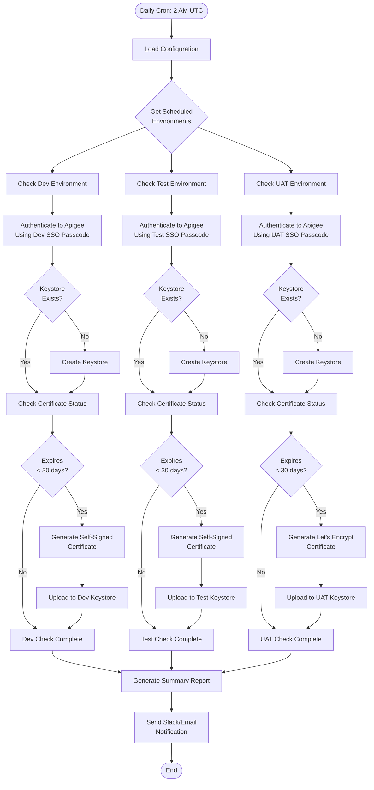
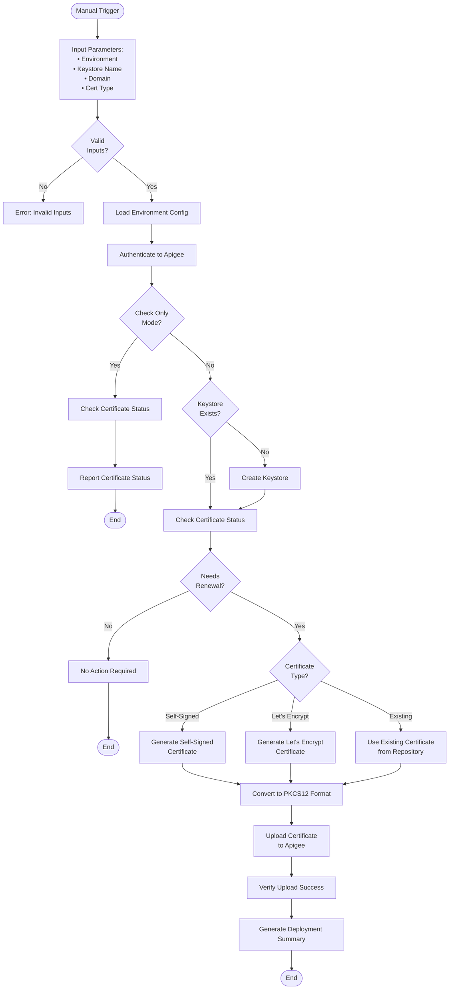

# Apigee Certificate Management Solution
## Design Document - Part 2: Workflow Diagrams & Processes

### Table of Contents
1. [Workflow Overview](#workflow-overview)
2. [Non-Production Certificate Management Flow](#non-production-certificate-management-flow)
3. [Production Certificate Deployment Flow](#production-certificate-deployment-flow)
4. [Certificate Generation Process Flow](#certificate-generation-process-flow)
5. [Error Handling and Recovery Workflows](#error-handling-and-recovery-workflows)

---

## 1. Workflow Overview

The solution implements two primary workflows:

### 1.1 Primary Workflows
```
┌─────────────────────────────────────────────────────────┐
│                    Certificate Management                 │
├─────────────────────────┬───────────────────────────────┤
│   Non-Production Flow   │    Production Flow            │
├─────────────────────────┼───────────────────────────────┤
│ • Automated daily check │ • Manual trigger only         │
│ • Auto-renewal          │ • Approval gates              │
│ • Self-signed/Let's     │ • Commercial certs            │
│   Encrypt certs         │ • Change ticket required      │
│ • No approval needed    │ • Backup before deployment    │
└─────────────────────────┴───────────────────────────────┘
```

## 2. Non-Production Certificate Management Flow

### 2.1 Daily Automated Check and Renewal Process



### 2.2 Manual Certificate Renewal Process (Non-Production)



## 3. Production Certificate Deployment Flow

### 3.1 Production Certificate Deployment with Approvals

```mermaid
flowchart TB
    Start([Manual Trigger]) --> InputProdParams[Input Parameters:<br/>• Keystore Name<br/>• Domain<br/>• Cert Source<br/>• Approval Ticket]
    
    InputProdParams --> ValidateTicket{Valid Ticket<br/>Format?}
    ValidateTicket -->|No| ErrorTicket[Error: Invalid Ticket Format<br/>Must match CHG#######]
    ValidateTicket -->|Yes| ValidateDomain{Valid Domain<br/>Pattern?}
    
    ValidateDomain -->|No| SkipCheck{Skip Domain<br/>Validation?}
    SkipCheck -->|No| ErrorDomain[Error: Domain doesn't match<br/>production pattern]
    SkipCheck -->|Yes| ProceedWithCaution[Log: Domain validation skipped]
    ValidateDomain -->|Yes| BackupPhase[Backup Current Certificate]
    ProceedWithCaution --> BackupPhase
    
    BackupPhase --> AuthProd[Authenticate to Production]
    AuthProd --> CheckCurrentCert{Current Cert<br/>Exists?}
    
    CheckCurrentCert -->|Yes| BackupCert[Backup Certificate Details<br/>to Artifact]
    CheckCurrentCert -->|No| NoBackup[Log: No existing cert to backup]
    
    BackupCert --> GenerateCertPhase[Certificate Generation Phase]
    NoBackup --> GenerateCertPhase
    
    GenerateCertPhase --> DetermineSource{Certificate<br/>Source?}
    
    DetermineSource -->|Let's Encrypt| CheckLECreds{LE Credentials<br/>Available?}
    DetermineSource -->|DigiCert| CheckDCCreds{DigiCert Creds<br/>Available?}
    DetermineSource -->|Existing File| CheckExistingFile{File Exists?}
    DetermineSource -->|Self-Signed| WarnSelfSigned[Warning: Self-Signed<br/>for Production!]
    
    CheckLECreds -->|No| ErrorLE[Error: Missing LE Credentials]
    CheckLECreds -->|Yes| GenerateLE[Generate Let's Encrypt<br/>Certificate via DNS Challenge]
    
    CheckDCCreds -->|No| ErrorDC[Error: Missing DigiCert Credentials]
    CheckDCCreds -->|Yes| RetrieveDC[Retrieve DigiCert<br/>Certificate via API]
    
    CheckExistingFile -->|No| ErrorFile[Error: Certificate File Not Found]
    CheckExistingFile -->|Yes| LoadExisting[Load Existing Certificate]
    
    WarnSelfSigned --> GenerateSelfSigned[Generate Self-Signed Certificate]
    
    GenerateLE --> ValidateCert[Validate Certificate:<br/>• CN matches domain<br/>• Key size ≥ 2048<br/>• Chain validity]
    RetrieveDC --> ValidateCert
    LoadExisting --> ValidateCert
    GenerateSelfSigned --> ValidateCert
    
    ValidateCert --> ConvertPKCS12Prod[Convert to PKCS12]
    ConvertPKCS12Prod --> ApprovalGate{Production<br/>Approval<br/>Required}
    
    ApprovalGate --> WaitApproval[Wait for Manual Approval<br/>via GitHub Environment]
    WaitApproval --> ApprovalReceived{Approval<br/>Received?}
    
    ApprovalReceived -->|No| Timeout[Deployment Cancelled<br/>Timeout/Rejection]
    ApprovalReceived -->|Yes| DeployProd[Deploy to Production]
    
    DeployProd --> AuthProdDeploy[Authenticate for Deployment]
    AuthProdDeploy --> EnsureKeystore[Ensure Keystore Exists]
    EnsureKeystore --> UploadProdCert[Upload Certificate<br/>Force Overwrite]
    
    UploadProdCert --> VerifyDeployment[Verify Deployment:<br/>• Retrieve cert details<br/>• Confirm upload success]
    
    VerifyDeployment --> PostDeployTest[Post-Deployment Validation:<br/>• HTTPS connectivity test<br/>• Certificate chain verification]
    
    PostDeployTest --> DeploymentReport[Generate Deployment Report]
    DeploymentReport --> NotifyTeam[Send Notifications:<br/>• Slack<br/>• Email<br/>• Include status & details]
    
    NotifyTeam --> End([End])
    
    ErrorTicket --> End
    ErrorDomain --> End
    ErrorLE --> End
    ErrorDC --> End
    ErrorFile --> End
    Timeout --> End
